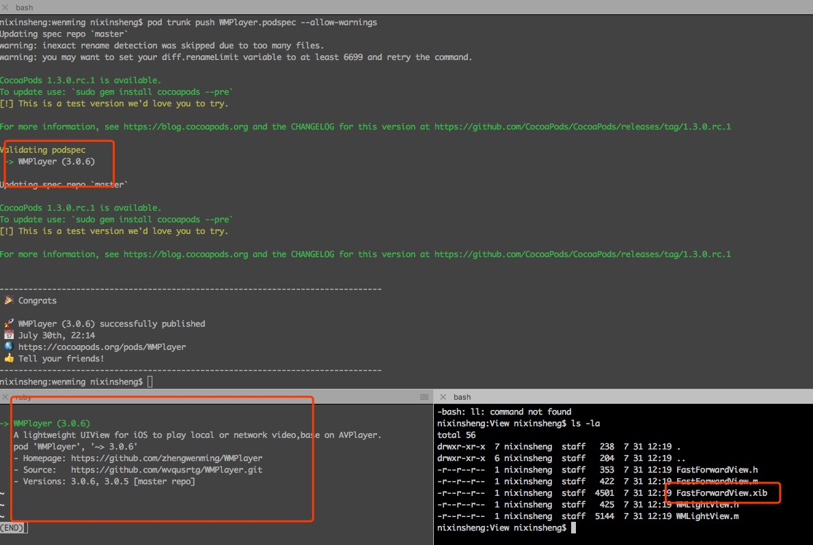
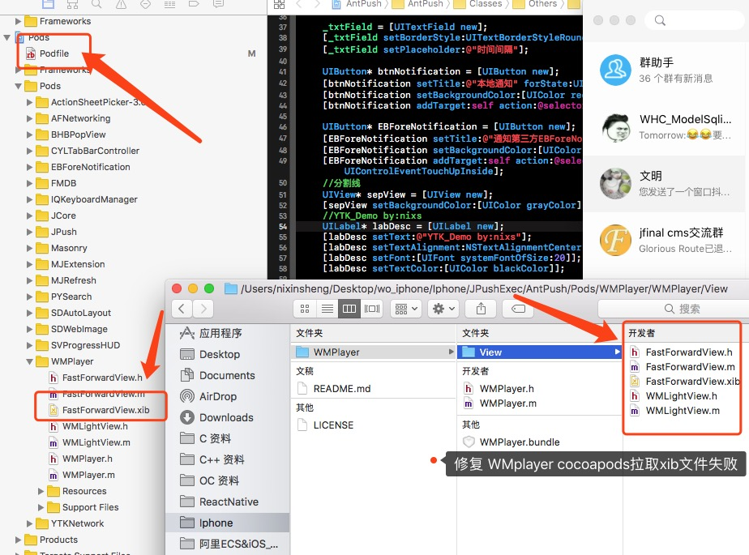

# WMPlayer更新日志

#### Version-4.0.0 (修复视频全屏的bug,具体表现为键盘和状态栏方向不一致)
#### Version-4.1.0 (修复present出来WMPlayer无法全屏显示的bug)
#### Version-4.2.0 (适配iOS 11、适配iPhone X)---------2017.10.15
#### Version-5.0.0 (添加新功能点如下)---------2018.05.22

WMPlayer5.0版本新功能
1、添加后台播放功能开关，开发者可以选择性使用后台播放功能
2、添加全屏后底部progress进度条指示当前进度
3、添加视频播放器的锁定🔒功能
4、优化视频旋转的功能（不在维护单独旋转view）
5、全面适配iPhone X，效果如同腾讯视频全屏界面
6、解决手势返回时刻，旋转视频的bug
7、添加WMPlayerModel，统一管理播放数据，更MVC
8、添加两个初始化方法，+方法和-方法，初始化更便捷

---
微信扫码关注文明的iOS开发公众号
或者微信搜索“iOS开发by文明”


---


[](https://github.com/Carthage/Carthage)
[](http://cocoadocs.org/docsets/WMPlayer)
[](https://travis-ci.org/WMPlayer/WMPlayer)

>
>

WMPlayer视频播放器，AVPlayer的封装，继承UIView，想怎么玩就怎么玩。支持播放mp4、m3u8、3gp、mov，网络和本地视频同时支持。全屏和小屏播放同时支持。
cell中播放视频，全屏小屏切换自如。

   

#用法，Usage
1.初始化

* 播放网络视频

```
    wmPlayer = [[WMPlayer alloc]initWithFrame:playerFrame];
    
    [wmPlayer setURLString:@"http://static.tripbe.com/videofiles/20121214/9533522808.f4v.mp4"];
    
    [self.view addSubview:wmPlayer];
    
    [wmPlayer play];
```

* 播放本地视频

```
    wmPlayer = [[WMPlayer alloc]initWithFrame:playerFrame];
    
     NSURL *URL = [NSURL fileURLWithPath:[[NSBundle mainBundle] pathForResource:@"4k" ofType:@"mp4"]];
     
    NSString *urlstring = [URL absoluteString];
    
    [self.wmPlayer setURLString:urlstring];
    
    [self.view addSubview:wmPlayer];
    
    [wmPlayer play]; 
```    
  
 
 
* 全屏播放视频解决方案

*   WMPlayer 同时支持持旋转 view 和旋转 ViewController
  
  
  
    1、旋转view
    思路：顾名思义，就是讲WMPlayer旋转90°，然后设置宽高为屏幕的宽和高，先从父视图上（可能是self.view）移除，然后在屏幕旋转的通知里面add到window上，造成全屏的效果，或者说造成全屏的假象吧。
    案例：网易新闻
    代码：详见demo中的腾讯tab对应的TencentNewsViewController.m里面，一定要添加全屏按钮的点击事件，并添加了代码才能有全屏的效果，不然就是一个普通的Button，点击没反应的。
    
 
 
    2、旋转ViewController
    思路：状态栏旋转，然后处理视频播放器的逻辑。（记住项目设置里面勾选☑️其他三个屏幕方向）
    案例：今日头条、新浪新闻
    代码：详见demo中的新浪tab对应的SinaNewsViewController.m里面，一定要添加全屏按钮的点击事件，并添加了代码才能有全屏的效果，不然就是一个普通的Button，点击没反应的。
    
  
# Android拍摄视频，上传服务器，iOS端无法播放，请☞戳这里
【链接】Android拍摄的视频无法在iOS播放
http://blog.csdn.net/u012992171/article/details/50673305 

（安卓音频编码使用了AMR_NB，苹果不支持这个音频的解码，请安卓使用苹果端支持的AAC音频编码）

    
# 另外关于程序崩溃在main中，但是手动的过了这个崩溃断点又可以继续运行，貌似又没有崩溃的问题，解释如下：(有些人不知道，总说我在代码中下毒了，冤枉！！！)
这是异常断点导致的，cocoa在某些框架中会加异常的捕获，而这个是系统级别的，AVFoundation这个框架就是。
stackoverflow中有详细的解释，解决方法也有。地址为：
http://stackoverflow.com/questions/26408264/xcode-6-0-1-begins-with-breakpoint-thread-1-breakpoint-1-2


# 升级iOS10后,AVPlayer有时候播放不了的问题
参考以下链接
http://blog.csdn.net/viiimaus/article/details/54926022
https://developer.apple.com/reference/avfoundation/avplayer/1643482-automaticallywaitstominimizestal


The problem is that you have a global Exceptions breakpoint. For some reason, an exception is being thrown. But not every exception is fatal; this one is being caught internally by Cocoa. So, you have two choices:

Hit the Exceptions breakpoint and resume.
Temporarily turn off the Exceptions breakpoint (in the Breakpoints navigator).
It is a little infuriating that this happens, but that's how it is. There are a lot of situations where Cocoa throws and catches an exception internally. (For example, AVFoundation does this a lot.) This would normally go unnoticed, but when you have a global Exceptions breakpoint enabled, it causes a pause whenever this occurs.

依赖库为Masonry。
使用过程中有bug，请联系我，我会及时修复。谢谢大家的支持。

欢迎加入iOS开发技术支持群，479259423，（付费群，手机端可以加，电脑加不了。慎入！）进群必须改名，群名片格式：城市-iOS-名字，例如广州-iOS-文明。
欢迎关注我的斗鱼直播间，用手机下载斗鱼TV，搜索“文明直播间”或者“极端恐惧”就可以找到我的直播间。iOS技术分享直播。点关注不迷路，开播会有推送到大家手机。（个人直播，非机构非机构，适合初级iOS和中级iOS）。
 
福利，往期斗鱼直播视频地址  https://pan.baidu.com/s/1c1YCgQc

1、runtime的不扯淡不装逼不理论视频，让你学会runtime真正如何运用到项目中。

2、纯代码简单实现微信朋友圈页面的视频等。

3、swift3.0项目实战（项目源代码+视频）。
